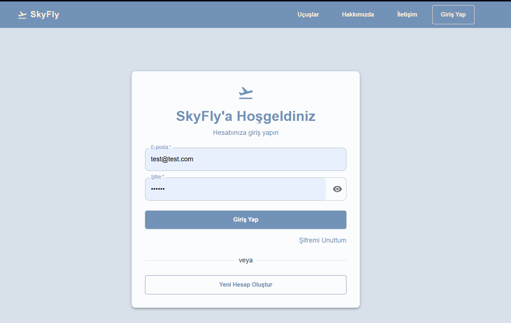
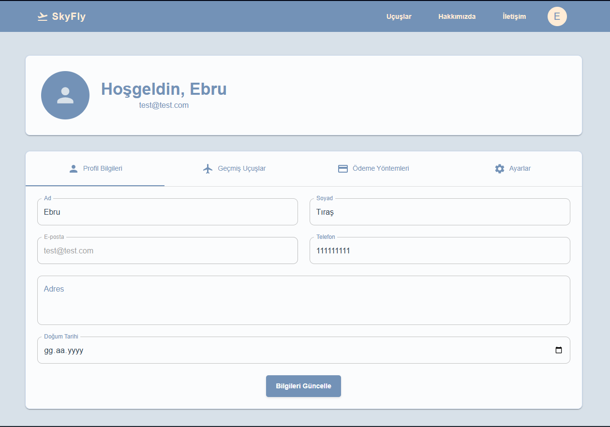
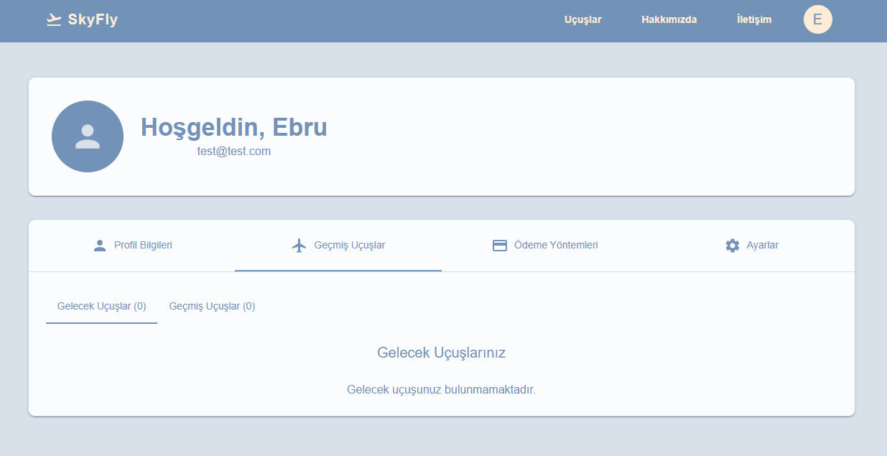
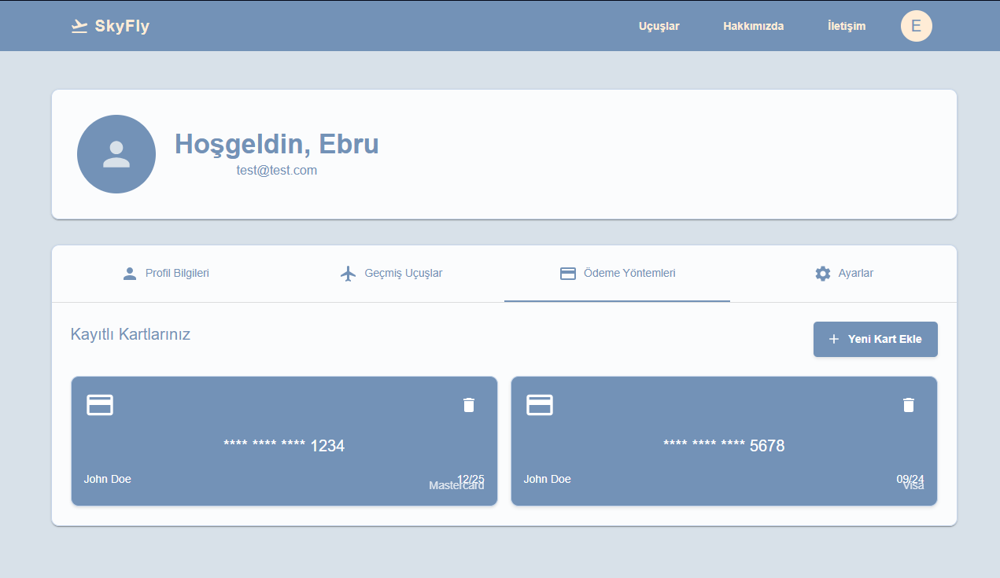
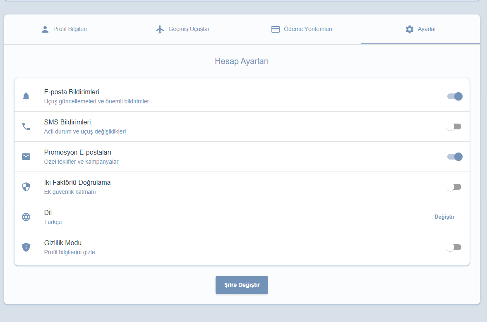
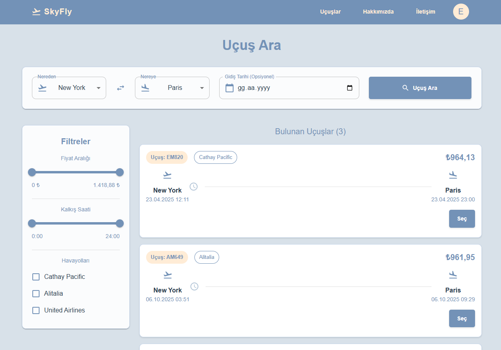
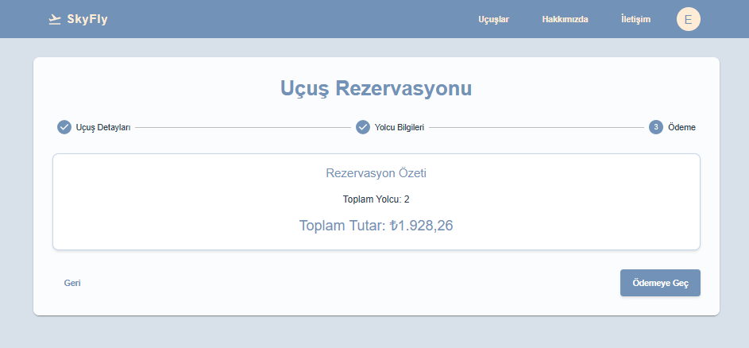
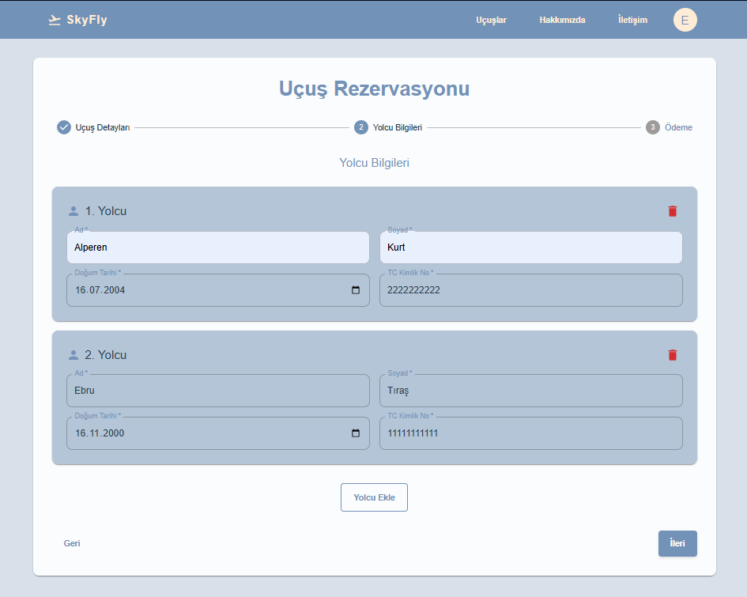
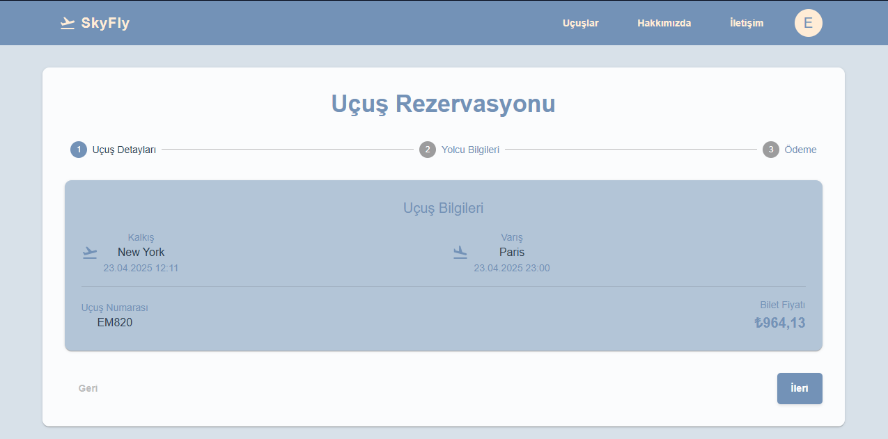
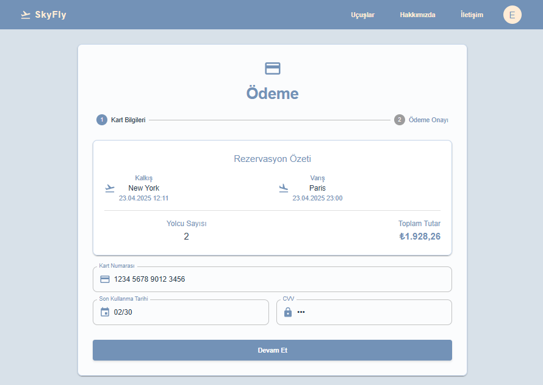

# ✈️ SkyFly

<div align="center">


[](https://reactjs.org/)
[](https://spring.io/projects/spring-boot)
[](https://www.oracle.com/java/)
[](https://mui.com/)

**Modern flight booking platform with React frontend and Spring Boot backend**

</div>

---

## 🚀 Quick Start

### 🐳 Docker (Recommended)

```bash
# Clone repository
git clone https://github.com/ebrutira/SkyFly.git
cd SkyFly

# Start all services with Docker Compose
docker-compose up -d

# View logs
docker-compose logs -f
```

**Access:** Frontend: http://localhost:3000 | Backend: http://localhost:8080

### 📋 Manual Installation

#### Prerequisites
- Java 21+
- Node.js 18+
- Maven 3.6+
- SQL Server

#### Installation

```bash
# Clone repository
git clone https://github.com/ebrutira/SkyFly.git
cd SkyFly

# Backend
cd SkyFly/SkyFly
mvn clean install
mvn spring-boot:run

# Frontend (new terminal)
cd frontend
npm install
npm start
```

**Access:** Frontend: http://localhost:3000 | Backend: http://localhost:8080

---

## ✨ Features

- 🔍 **Flight Search** - Advanced search with filters
- 👤 **User Management** - Registration, authentication, profiles
- 💳 **Booking System** - Complete booking flow with payment
- 📱 **Responsive Design** - Mobile-first Material-UI interface
- 🔐 **Security** - JWT authentication with Spring Security

## 📱 Pages (12 Total)

### 🏠 Main Pages
- **Ana Ekran** - Homepage with flight search

### 🔐 Authentication
- **Kullanıcı Girişi** - Login page

### 👤 User Management (4 pages)
- **Profil Bilgileri** - User profile information
- **Geçmiş Uçuşlar** - Past flights history
- **Ödeme Yöntemleri** - Payment methods
- **Ayarlar** - User settings

### ✈️ Flight Search (2 pages)
- **Uçuş Arama** - Flight search form
- **Uçuş Sonuçları** - Flight search results

### 🎫 Booking Process (4 pages)
- **Bilet Detayları** - Ticket details
- **Yolcu Ekleme** - Add passengers
- **Uçuş Bilgileri** - Flight information
- **Ödeme** - Payment processing

---

## 🛠️ Tech Stack

| Frontend | Backend | Database |
|----------|---------|----------|
| React 19.0.0 | Spring Boot 3.4.1 | SQL Server |
| Material-UI 6.3.1 | Spring Security | H2 (Dev) |
| React Router 7.1.1 | Spring Data JPA | |
| Axios 1.7.9 | JWT Authentication | |

---

## 📁 Project Structure

```
skyfly/
├── frontend/          # React app
│   ├── src/
│   │   ├── components/
│   │   ├── pages/
│   │   ├── services/
│   │   └── contexts/
│   └── package.json
├── SkyFly/SkyFly/     # Spring Boot app
│   ├── src/main/java/
│   │   └── com/comp301project/SkyFly/
│   │       ├── Controller/
│   │       ├── Service/
│   │       ├── Model/
│   │       └── Security/
│   └── pom.xml
└── assets/            # Screenshots & images
    └── screenshots/
```

---

## 🖼️ Screenshots

### 🏠 Main Pages

*Ana sayfa - Uçuş arama formu*

### 🔐 Authentication

*Kullanıcı giriş sayfası*

### 👤 User Management

*Kullanıcı profil bilgileri*


*Geçmiş uçuşlar listesi*


*Ödeme yöntemleri yönetimi*


*Kullanıcı ayarları*

### ✈️ Flight Search

*Uçuş arama formu*


*Uçuş arama sonuçları*

### 🎫 Booking Process

*Bilet detayları sayfası*


*Yolcu bilgileri ekleme*


*Uçuş bilgileri özeti*


*Ödeme işlemi sayfası*

---

## 📚 API Endpoints

### Authentication
- `POST /api/auth/register` - User registration
- `POST /api/auth/login` - User login

### Flights
- `GET /api/flights` - Get all flights
- `GET /api/flights/search` - Search flights
- `GET /api/flights/{id}` - Get flight details

### Bookings
- `POST /api/bookings` - Create booking
- `GET /api/bookings/user/{userId}` - User bookings
- `DELETE /api/bookings/{id}` - Cancel booking

---

## ⚙️ Configuration

### Database (application.properties)
```properties
spring.datasource.url=jdbc:sqlserver://localhost:1433;databaseName=skyflydatabase
spring.datasource.username=your_username
spring.datasource.password=your_password
server.port=8080
jwt.secret=your_jwt_secret
```

### Frontend (.env)
```env
REACT_APP_API_URL=http://localhost:8080
```

---

## 🧪 Testing

```bash
# Backend tests
cd SkyFly/SkyFly && mvn test

# Frontend tests
cd frontend && npm test
```

---

## 🐳 Docker Commands

### Development
```bash
# Start all services
docker-compose up -d

# View logs
docker-compose logs -f

# Stop services
docker-compose down

# Rebuild and start
docker-compose up --build -d
```

### Production
```bash
# Build images
docker-compose -f docker-compose.yml build

# Start production services
docker-compose -f docker-compose.yml up -d

# Scale services
docker-compose up --scale backend=3 -d
```

### Individual Services
```bash
# Backend only
docker-compose up backend database -d

# Frontend only
docker-compose up frontend -d

# Database only
docker-compose up database -d
```

## 📦 Deployment

### Docker Deployment (Recommended)
```bash
# Production deployment
docker-compose -f docker-compose.yml up -d

# With custom environment
docker-compose -f docker-compose.yml -f docker-compose.prod.yml up -d
```

### Manual Deployment

#### Backend
```bash
mvn clean package -DskipTests
java -jar target/SkyFly-0.0.1-SNAPSHOT.jar
```

#### Frontend
```bash
npm run build
# Deploy build/ folder to web server
```

---

## 🤝 Contributing

1. Fork the repository
2. Create feature branch: `git checkout -b feature/amazing-feature`
3. Commit changes: `git commit -m 'Add amazing feature'`
4. Push to branch: `git push origin feature/amazing-feature`
5. Open Pull Request

---

## 👥 Team

- **Ebru Tıraş** - *Full Stack Developer* - [@ebrutira](https://github.com/ebrutira)
- **Alperen Kurt** - *Full Stack Developer* - [@alperenkurtt](https://github.com/alperenkurtt)

---

<div align="center">

**⭐ Star this repo if you found it helpful!**

Made with ❤️ by [Ebru Tıraş](https://github.com/ebrutira) & [Alperen Kurt](https://github.com/alperenkurtt)

</div>

